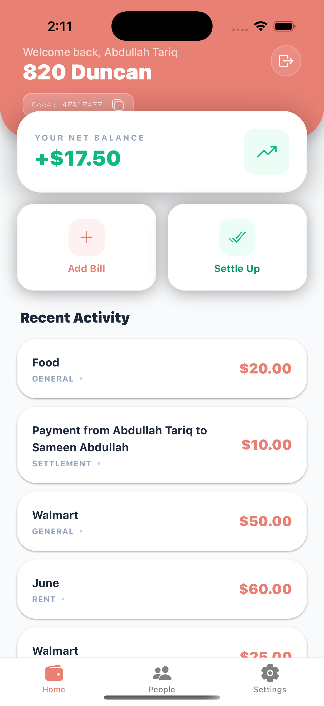
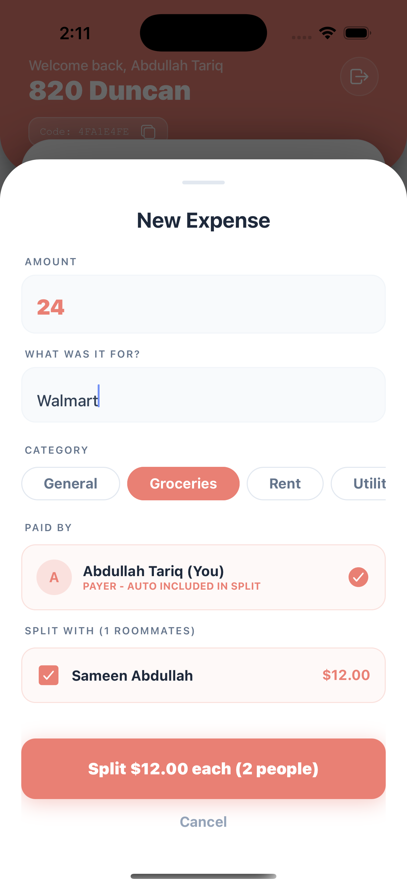
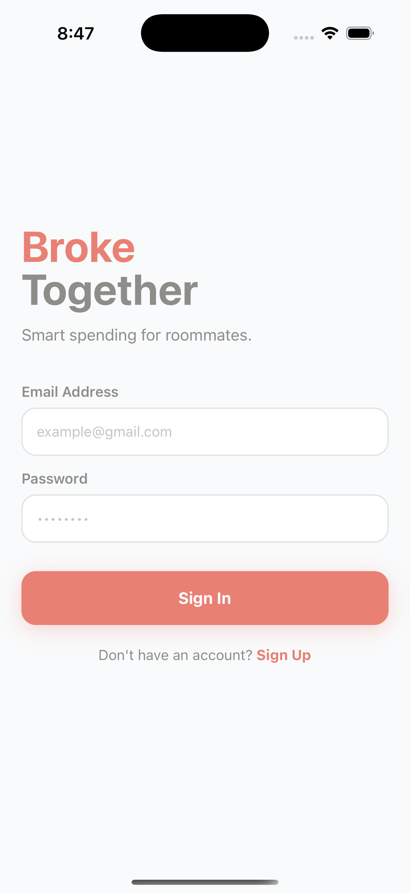
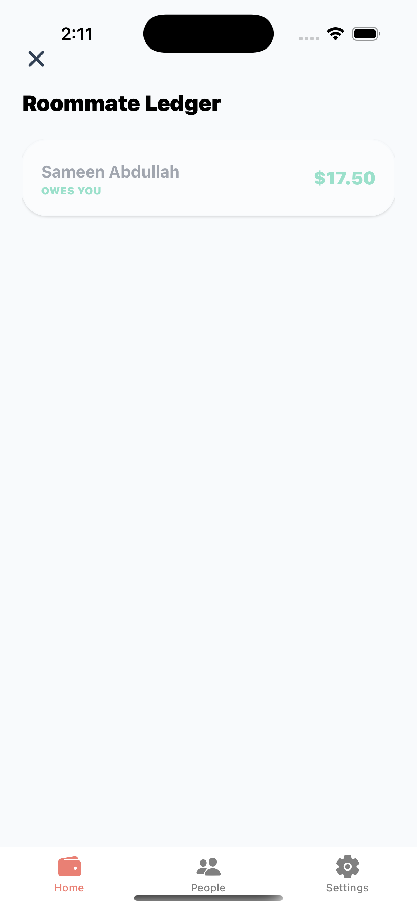

# 🏠 BrokeTogether Client

A modern React Native mobile app for splitting expenses with roommates. Stop the awkward money conversations and keep track of shared expenses effortlessly.

> 🏆 Built for **RevenueCat Shipaton 2026** — Next Gen Award entry. Powered by the [BrokeTogether Spring Boot API](https://github.com/Abdullahtariq11/BrokeTogetherBackend).

## 🎬 Demo Video

▶️ [Watch the demo](https://www.youtube.com/) *(link goes live before the submission deadline)*


## 📱 Screenshots

<p align="center">
  
  
  
  
</p>

## ✨ Features

- **🔐 Secure Authentication** - JWT-based login/register with auto-logout after 30 minutes of inactivity
- **🏡 Household Management** - Create homes and invite roommates via unique invite codes
- **💰 Expense Tracking** - Add bills and split them equally or selectively among roommates
- **📊 Real-time Balances** - Dashboard showing who owes what at a glance
- **✅ Settle Up** - Record payments and clear debts with one tap
- **👥 Member Management** - View roommates and remove members (admin only)
- **🔄 Pull-to-Refresh** - Stay up to date with the latest data
- **💎 Broketogether Pro** - Premium subscription powered by RevenueCat (see [Monetization](#-monetization))

## 💎 Monetization

**Broketogether Pro** is the premium subscription, powered by the [RevenueCat](https://www.revenuecat.com/) SDK (entitlement: `Broketogether Pro`, monthly/yearly products on Google Play and the App Store).

What's included:
- 🛒 Shared shopping list with price tracking
- 🔄 Convert shopping items to expenses instantly
- 📈 Advanced expense analytics & insights
- 👥 Unlimited household members
- 🔔 Smart payment reminders

The paywall lives in the Profile tab (`features/profile/PremiumScreen.jsx`) and the entitlement check runs through `config/revenuecat.js`.

## 🛠️ Tech Stack

| Category | Technology |
|----------|------------|
| Framework | React Native + Expo |
| Styling | NativeWind (Tailwind CSS) |
| State Management | React Context API |
| Navigation | React Navigation |
| HTTP Client | Axios |
| Secure Storage | Expo SecureStore |
| Monetization | RevenueCat |
| Icons | Expo Vector Icons (Ionicons) |

## 📁 Project Structure

```
BrokeTogetherClient/
├── api/
│   ├── client.js           # Axios instance with interceptors
│   ├── authService.js      # Authentication API calls
│   ├── homeService.js      # Home/household API calls
│   └── expenseService.js   # Expense API calls
├── components/
│   └── ActivityTracker.js  # Inactivity timeout wrapper
├── context/
│   └── AuthContext.js      # Authentication state management
├── features/
│   ├── Dashboard.jsx       # Main dashboard screen
│   ├── auth/
│   │   ├── LoginScreen.jsx
│   │   └── RegisterScreen.jsx
│   ├── home/
│   │   ├── HomeSetupScreen.jsx
│   │   ├── MemberScreen.jsx
│   │   └── SettleScreen.jsx
│   ├── expense/
│   │   └── AddExpenseModal.jsx
│   └── profile/
│       └── ProfileScreen.jsx
├── navigation/
│   ├── AppNavigator.jsx    # Main navigation setup
│   └── AppTabs.jsx         # Bottom tab navigation
├── App.js                  # App entry point
├── app.json                # Expo configuration
├── tailwind.config.js      # Tailwind configuration
└── package.json
```

## 🚀 Getting Started

### Prerequisites

- Node.js (v16 or higher)
- npm or yarn
- Expo CLI (`npm install -g expo-cli`)
- Expo Go app on your mobile device (for testing)

### Installation

1. **Clone the repository**
   ```bash
   git clone https://github.com/Abdullahtariq11/BrokeTogetherClient.git
   cd BrokeTogetherClient
   ```

2. **Install dependencies**
   ```bash
   npm install
   # or
   yarn install
   ```

3. **Configure environment**
   
   Create or update `api/client.js` with your backend URL:
   ```javascript
   const client = axios.create({
       baseURL: 'https://your-backend-url.com/api/v1',
       timeout: 10000,
   });
   ```

4. **Start the development server**
   ```bash
   npx expo start
   ```

5. **Run on device/emulator**
   - Scan the QR code with Expo Go (Android) or Camera app (iOS)
   - Press `a` for Android emulator
   - Press `i` for iOS simulator

## ⚙️ Environment Configuration

Update the API base URL in `api/client.js`:

```javascript
// Development
baseURL: 'http://localhost:8080/api/v1'

// Production
baseURL: 'https://your-production-url.railway.app/api/v1'
```

## 📡 API Endpoints Used

### Authentication
| Method | Endpoint | Description |
|--------|----------|-------------|
| POST | `/auth/login` | User login |
| POST | `/auth/register` | User registration |
| POST | `/auth/google/mobile` | Google sign-in (mobile) |
| POST | `/auth/apple/mobile` | Apple sign-in (mobile) |
| POST | `/auth/forgot-password` | Request password-reset email |
| POST | `/auth/reset-password` | Reset password with token |

### User
| Method | Endpoint | Description |
|--------|----------|-------------|
| GET | `/users/me` | Get current user profile |
| PUT | `/users/edit` | Update display name |
| POST | `/users/password-reset` | Change password |

### Homes
| Method | Endpoint | Description |
|--------|----------|-------------|
| GET | `/homes/my-homes` | Get user's homes |
| POST | `/homes` | Create a new home |
| POST | `/homes/join` | Join home with invite code |
| GET | `/homes/{id}/members` | Get home members |
| GET | `/homes/{id}/invite-code` | Get invite code |
| DELETE | `/homes/{id}/members/{userId}` | Remove member |
| DELETE | `/homes/{id}/leave` | Leave home |

### Expenses
| Method | Endpoint | Description |
|--------|----------|-------------|
| POST | `/expenses` | Create expense (equal split) |
| POST | `/expenses/selective` | Create expense (selective split) |
| POST | `/expenses/split` | Create expense (custom split) |
| POST | `/expenses/settle` | Settle up with roommate |
| GET | `/expenses/home/{id}/history` | Get expense history |
| GET | `/expenses/home/{id}/balances` | Get home balances |
| GET | `/expenses/home/{id}/settlements` | Settlement suggestions |
| GET | `/expenses/home/{id}/analytics` | Expense analytics |
| DELETE | `/expenses/{id}` | Delete expense |

### Recurring Expenses
| Method | Endpoint | Description |
|--------|----------|-------------|
| POST | `/expenses/recurring` | Create recurring expense |
| GET | `/expenses/recurring/home/{id}` | List recurring expenses |
| DELETE | `/expenses/recurring/{id}` | Deactivate recurring expense |

### Shopping Items (Pro)
| Method | Endpoint | Description |
|--------|----------|-------------|
| POST | `/shopping-items` | Add shopping item |
| GET | `/shopping-items/home/{id}/items` | List home shopping items |
| PUT | `/shopping-items/item/{id}` | Edit shopping item |
| PATCH | `/shopping-items/item/mark/{id}` | Mark item purchased |
| DELETE | `/shopping-items/item/{id}` | Delete shopping item |
| POST | `/shopping-items/item/{id}/convert` | Convert item to expense |

### Billing
| Method | Endpoint | Description |
|--------|----------|-------------|
| GET | `/billing/status` | Get subscription status |
| POST | `/billing/portal` | Open Stripe customer portal |

## 🎨 Color Palette

| Color | Hex | Usage |
|-------|-----|-------|
| Primary | `#E98074` | Buttons, accents, highlights |
| Emerald | `#10b981` | Positive balances, success |
| Rose | `#f43f5e` | Negative balances, delete actions |
| Slate | `#334155` | Text, backgrounds |

## 📱 Key Screens

### Dashboard
- Displays user's net balance
- Quick actions: Add Bill, Settle Up
- Recent expense activity feed
- Pull-to-refresh functionality

### Add Expense Modal
- Amount and description input
- Category selection
- Selective member splitting
- Real-time split amount preview

### Settle Screen
- View balances with each roommate
- One-tap payment recording
- Color-coded owe/owed indicators

### Members Screen
- View all household members
- Admin badge for home creator
- Remove members (admin only)

## 🔒 Security Features

- **JWT Authentication** - Secure token-based auth
- **Secure Storage** - Tokens stored in Expo SecureStore
- **Auto Logout** - 30-minute inactivity timeout
- **Background Check** - Session validation on app resume

## 🧪 Running Tests

```bash
npm test
# or
yarn test
```

## 📦 Building for Production

### Android
```bash
expo build:android
# or with EAS
eas build --platform android
```

### iOS
```bash
expo build:ios
# or with EAS
eas build --platform ios
```

## 🤝 Contributing

1. Fork the repository
2. Create a feature branch (`git checkout -b feature/amazing-feature`)
3. Commit your changes (`git commit -m 'Add amazing feature'`)
4. Push to the branch (`git push origin feature/amazing-feature`)
5. Open a Pull Request

## 📄 License

This project is licensed under the MIT License - see the [LICENSE](LICENSE) file for details.

## 🔗 Related

- [BrokeTogether Backend](https://github.com/Abdullahtariq11/BrokeTogetherBackend) - Spring Boot REST API

## 👤 Author

**Abdullah Tariq**
- GitHub: [@Abdullah Tariq](https://github.com/Abdullahtariq11)
- LinkedIn: [Abdullah Tariq](https://www.linkedin.com/in/abdullah-tariq-499629171/)

---

<p align="center">
  Made with ❤️ and React Native
</p>
